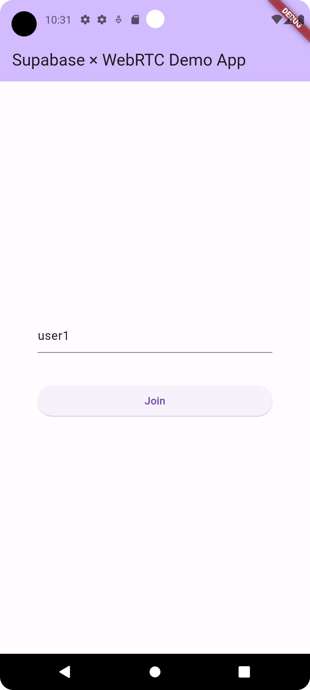
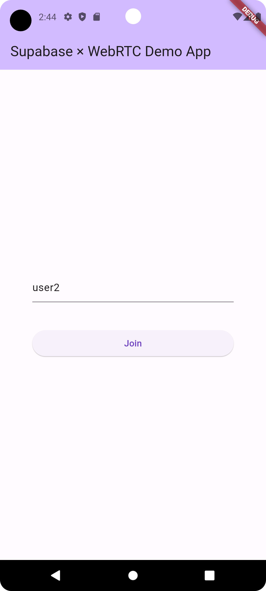
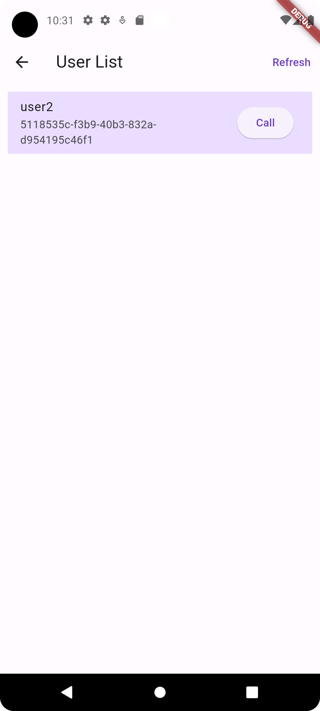
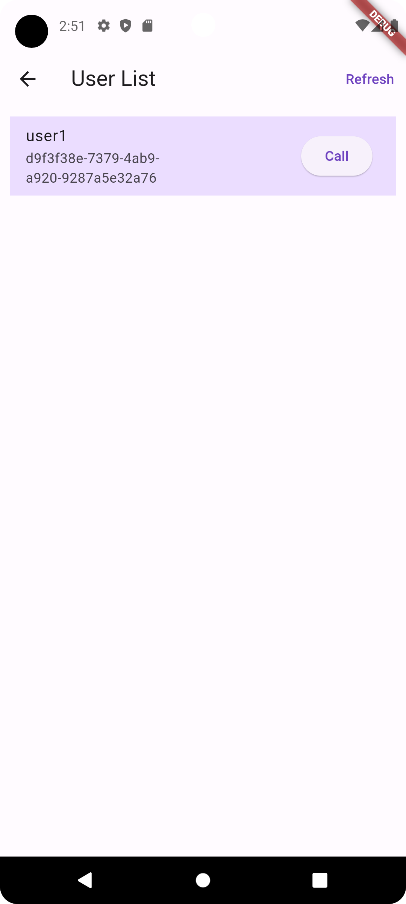
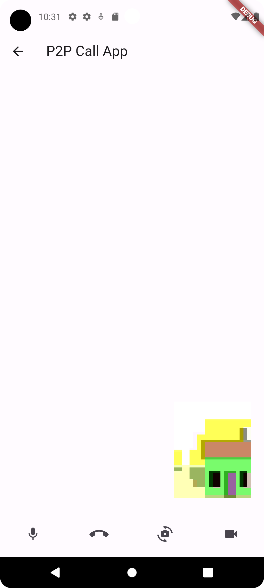
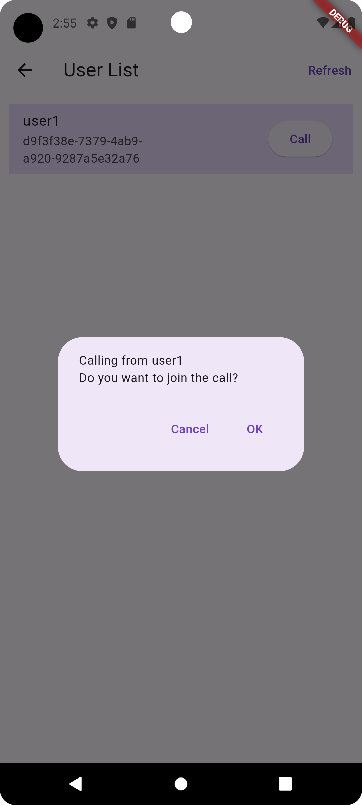

# sample_supabase_webrtc

Sample demo project for supabase and WebRTC

## Demo

Check out the [Live Demo](https://minnya.github.io/sample-supabase-webrtc) to see it in action.

## Premises
- Launch Supabase on your local environment
- Prepare tables `users` and `calls` on supabase accordingly to the following definition.

## Table definition: 
### users
- Enable Row Level Security (RLS): `disabled`
- Enable Realtime: `disabled`

| Name       | Type      | Remarks                               |
|------------|-----------|---------------------------------------|
| id         | uuid      | Automatically generated identifier    |
| name       | text      | Name of the user                      |
| created_at | timestamp | Timestamp when the record was created |


### calls
- Enable Row Level Security (RLS): `disabled`
- Enable Realtime: `enabled`

| Name          | Type          | Remarks                                      |
|---------------|---------------|----------------------------------------------|
| id            | bigint (int8) | Unique identifier for each record            |
| status        | text          | Indicates the status of calling              |
| caller_id     | uuid          | User id of the person who made the call      |
| callee_id     | uuid          | User id of the person who received the call. |
| sdp_offer     | json          | Peer information of the caller's device      |
| sdp_answer    | json          | Peer information of the callee's device      |
| ice_candidates| json          | Communication path information               |
| created_at    | timestamp     | Timestamp when the record was created        |

## Getting Started

### Step1. Clone Repository
Clone the repository to your local environment
```shell
git clone https://github.com/minnya/sample-supabase-webrtc.git
```

### Step2. Go to sample_supabase_webrtc
```shell
cd sample_supabase_webrtc
```

### Step3. Get dependencies
```shell
flutter pub get
```

### Step4. Update Supabase Server URL
Go to `main.dart` file, update the supabase url if necessary.

For further details about Supabase & Flutter, please refer to the official document from [here](https://pub.dev/packages/supabase_flutter)

```dart
// ...

String baseUrl = "";
String anonKey = "****"; // Replace here if necessary

void main() async{
  if(!kIsWeb && Platform.isAndroid){
    baseUrl = "http://10.0.2.2:8000";
  }else{
    baseUrl = "http://localhost:8000"; // Replace here if necessary
  }
  await Supabase.initialize(
    url: baseUrl,
    anonKey: anonKey,
  );
  runApp(const MyApp());
}

// ...
```

### Step5. Run the sample app
It's time to push the launch button.
```shell
flutter run
```

## How to use
1. When you launch the app in two different devices, you will see **Join screen** screen.<br>
Input username in the text box and press `Join` Button.

| Device 1                              | Device 2                              |
|---------------------------------------|---------------------------------------|
|  |  |

2. On **User List screen**, you will see users on the list who is using the same app.<br>
Press `Call` button on device 1 to make a call.

| Device 1                              | Device 2                              |
|---------------------------------------|---------------------------------------|
|  |  |

3. On the device 2, you will see dialog to confirm if you will join the call.<br>
press `OK` to join the call.

   | Device 1                              | Device 2                              |
   |---------------------------------------|---------------------------------------|
   |  |  |

## Reference
- https://github.com/videosdk-live/webrtc.git